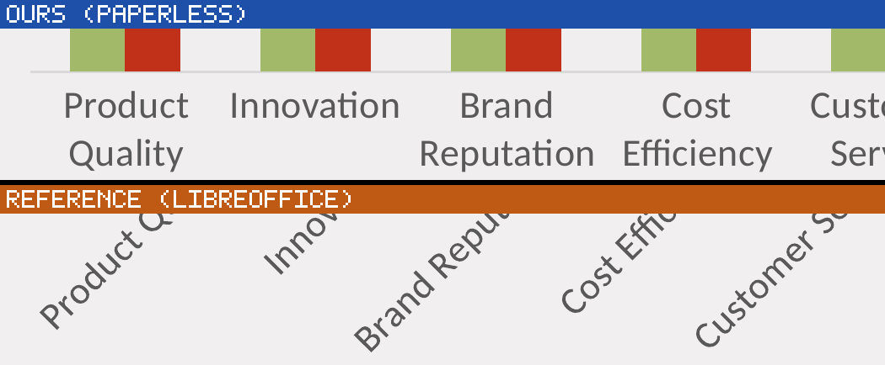

# A crowded category axis rotates in the reference and wraps in this tree

Found by looking at the page. `038_Competitive_Advantage_Card_for_PowerPoint_and_Google_Slides`
(`slides/chartset-008/pptx`) was carried as an unexplained `+136` glyph row, with the previous
round recording that *"neither side draws a single rotated line, so the stated shear rule does not
explain it — second trigger, unidentified"*. That statement is true and misleading: PyMuPDF reports
no rotated **text** line on either side, because the reference's rotated labels are not text.

## What the picture shows

The bar chart's five category labels. **We draw them horizontal and wrapped onto two lines**
(`Product` / `Quality`); **26.2.4.2 draws them on one line each, rotated about 45°.**

A blind reader given only the composed full page reported the two halves as containing the same
text in the same places and flagged only small vertical offsets — it did not see this, because at
full-page scale the axis band is forty pixels tall. **The crop is what made it visible**, which is
the case the skill describes: legibility was never the problem, framing was.

## The measurement the picture pointed at

In the band `(420, 330)–(700, 400)` of page 1:

| | filled paths | of them glyph-sized | words `pdftotext` extracts |
|---|---:|---:|---:|
| ours | 12 | 2 | **12** |
| 26.2.4.2 | 45 | **42** | 3 |

The reference's glyph-sized rects climb as they advance — `(419.2, 354.7)`, `(424.6, 352.3)`,
`(428.1, 349.1)` — which is the rising diagonal, measured rather than eyeballed.

**So the `+136` is two separate things, and only one of them is a defect.** The reference outlines
those labels, so `pdftotext` cannot see them and the gate counts them as ours alone: exactly
`Product Quality` + `Customer Service` + `Cost Efficiency` + `Brand Reputation` + `Innovation` =
**68 characters per page over two pages = 136**, which is the whole row. That half is the outlining
ceiling and our searchable text is arguably the better output. The other half — *horizontal and
wrapped* against *rotated* — is a real layout difference and is what this entry is about.

## The rule, read out of chart2

An overcrowded horizontal category axis escalates in three steps, and the first step's *permission*
switches the other two off:

1. **Break lines** — `VCartesianAxis::isBreakOfLabelsAllowed` (`:514-522`) requires
   `m_bLineBreakAllowed`, at most 100 labels, no stacked characters, and not a value axis.
   `m_bLineBreakAllowed` **defaults to false** (`VAxisProperties.cxx:353`) and is read from the
   axis's `TextBreak` property (`:369`).
2. **Stagger** onto two rows — `VCartesianAxis.cxx:919-922`, taken first when rotation is not
   allowed or `m_bTryStaggeringFirst` is set.
3. **Rotate 45°** — when staggering did not clear the overlap and rotation is allowed
   (`:934-947`), `AxisLabelProperties::autoRotate45` sets the angle to 45, **turns line breaking
   off**, and puts the labels side by side (`VAxisProperties.cxx:403-408`).

The gate between them is `canAutoAdjustLabelPlacement` (`:539-556`), shared by stagger and rotate
under two names: it returns false when overlap is allowed, when **`m_bLineBreakAllowed` is true**
(*"auto line break may conflict with…"*), when a rotation is already stated, or when the axis is
not horizontal-with-horizontal-text.

So the two behaviours are mutually exclusive by construction. An axis that may break lines never
rotates; an axis that may not, rotates rather than wraps. **This tree wraps unconditionally**, which
is the behaviour of an axis whose `TextBreak` is permanently true.

## What a round has to establish

- **Where `TextBreak` comes from for each reader.** It is a chart2 model property; the OOXML,
  BIFF and ODF chart importers each have to set it, and this document's is evidently false. Read
  the importer rather than assuming a default.
- **The order.** Implementing rotation without the stagger step will rotate labels the reference
  merely staggers.
- **The reach**, which is not yet measured. The signature is a *positive* glyph delta on a
  chart-bearing document, because rotated labels leave the reference's text layer entirely. The
  positive `chartset` rows at `probes/orig-gate-r83` are the place to census: `057` +308,
  `038` +136, `030` +103, `033` +70, `053` +31, `029` +29, `065` +20, `040` +18, `075` +18 — but
  note `057` was measured by an earlier round as having **20 turned lines of our own**, so it is
  not the same case and must not be swept in with this one.
- **That the gate will not reward it.** Rotating these labels does not change the character count
  either side, because the reference's copies are outlines whatever their angle. Score this on the
  drawn geometry, not on the gate.
