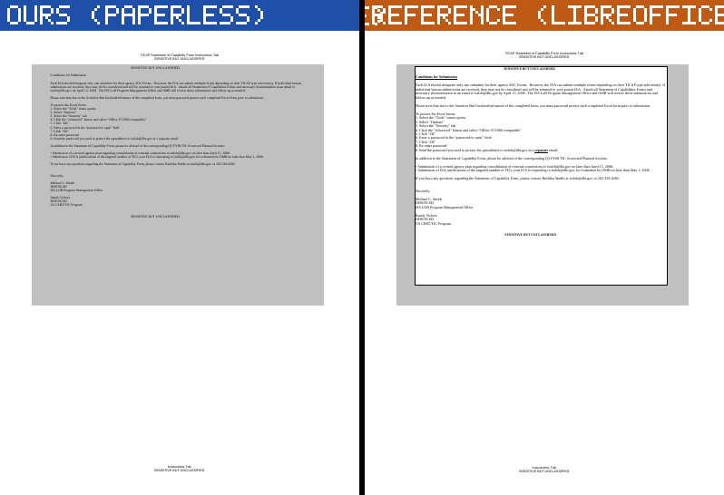

# A sheet text box's fill and outline are not drawn, and the gate cannot see it

Found by ranking **passing** documents by ink and looking at the worst — the habit
`page-vision` calls the highest-yield one, and it paid here on the first document.

`sheets/done-014/xls/TICAPCapability_Final.xls` **passes the gate** — page count and character
count both match. It tops a 48-document sample of passing slides and sheets at **16.87 % summed
unsigned ink**, with pages 2 and 3 scored MAJOR at 6.52 % and 7.28 %.

## What is missing

The reference's page 3 holds **five** drawings:

| | rect | fill | stroke |
|---|---|---|---|
| grey backdrop | (54, 57, 552, 469) | `#C0C0C0` | — |
| **white panel** | **(86, 61, 516, 434)** | **`#FFFFFF`** | — |
| **its outline** | **(86, 61, 516, 434)** | — | **`#000000`, 0.42 pt** |

Ours holds **901** drawings and **not one of them is stroked or white-filled**. The grey is there —
both sides cover **42.4 %** of the page with it, we simply paint it per cell where the reference
merges it — so the whole difference is the white panel and its outline, and the text then sits
directly on grey instead of inside a bordered white box.

**The shape is in the file and we are already reading its text.** 26.2.4.2's own flat ODF for the
document gives the `Instructions` sheet two `draw:custom-shape` text boxes, `Text 229` and
`Text 230`, whose graphic styles state exactly:

    draw:stroke="solid"  svg:stroke-width="0.0102in"  svg:stroke-color="#000000"
    draw:fill="solid"    draw:fill-color="#ffffff"

We draw their text — it is on our page — and drop the fill and the stroke. In BIFF these are
Escher shape containers, so the seat is the `.xls` shape reader's handling of a text box's
`msofbtOPT` fill and line properties.

Per page, ours against the reference, stroked/white-filled:

    p1  0/0  vs 1/0        p2  0/0 vs 5/1        p3  0/0 vs 3/1
    p4 25/114 vs 25/7      p8 46/100 vs 46/12    p14 98/130 vs 98/12

Pages 1-3 are the `Instructions` sheet and we draw **no** stroked path at all there; from page 4 on
our stroke counts track the reference's to within one or two. So this is not a general failure to
stroke — it is confined to whatever pages 1-3 do differently, which is that their content is a
shape rather than cells.

## An instrument warning, because I nearly filed a much bigger claim

Counting stroked and white-filled paths across the sample says **44 of 48 passing documents draw
fewer than the reference somewhere**, led by `AIM_OPR_LIST__xls` at 3452 strokes over 166 pages.
**That number is close to meaningless.** Path *count* is a fact about how a renderer structures its
output, not about what lands on the page: on this very document we draw 901 grey fills where the
reference draws one, covering the identical area. `AIM_OPR_LIST` does not appear in the top sixteen
by ink at all, so its 3452 "missing" strokes cost it under 0.31 %.

**Rank on ink; use path counts only to explain a difference ink has already found.** The TICAP case
is believable because ink found it first (7.28 % on one page), the drawing dump then said which
three objects differ, and the reference's own flat ODF named the shape and quoted its style.

## What a round has to do

1. Read the BIFF shape path and find where a text box's fill and line are dropped. The text is
   already being drawn, so the object is reached — this is about its properties, not its
   discovery.
2. Check the same question for the OOXML and ODF sheet readers before assuming it is BIFF-only.
3. Census on **ink**, not on path counts, and re-rank the passing set afterwards.
4. Expect no gate movement. This document passes now and will pass after; the character count is
   untouched.
