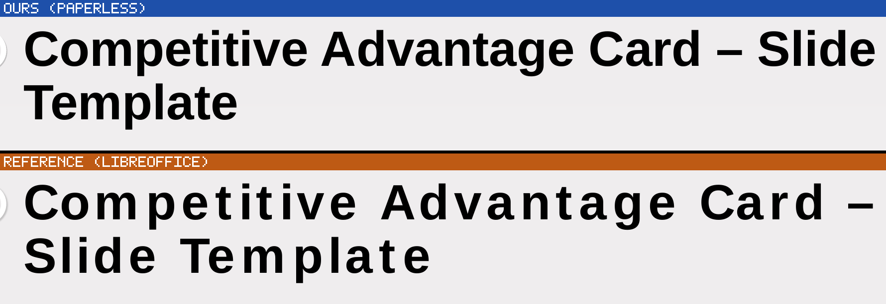

# A slide title advances at a different font's metrics in the reference

> **CORRECTED, same day, before anything was dispatched on it.** This was first written up as
> *"the reference tracks the title out 18 %"*, with a claim that the glyph ink was identical on
> both sides. **The tracking framing is wrong** and the ink claim was not measured: the widths
> compared were PyMuPDF `rawdict` character *cell* boxes, which are derived from the advance and
> the font's vertical metrics, not from ink. The corrected reading is below. The measurements of
> *advance* — which is what the rest of this file rests on — are unaffected.

> **SETTLED by `probes/title-font-r92/`.** The corrected reading above is confirmed, widened from 8
> glyphs to 16 and scored against every face on the box (DejaVu Sans Bold at 0.9 thousandths of an
> em a glyph, next face 27× further), and the outlines were extracted and confirmed to be
> Liberation Sans Bold's. The mechanism is the declared **family class**: 26.2.4.2 appends `sans`
> to the fontconfig pattern for `FAMILY_SWISS` (`vcl/unx/generic/font/fontconfig.cxx`:1076-1087)
> when editeng measures, and `drawinglayer::attribute::FontAttribute` has no field for the family
> class, so the font rebuilt to *draw* is `FAMILY_DONTKNOW` and resolves elsewhere. **The two leads
> named at the bottom of this file are both refuted there**: `panose` does nothing, and the
> vertical overflow is identical in a variant that does not show the effect at all. No code
> changed; read r92 §6-§7 before working from this file.

Found by looking at the page. `pdf-image-diff` on
`slides/chartset-008/pptx/038_Competitive_Advantage_Card_for_PowerPoint_and_Google_Slides`
flags the title band as *"marks displaced or reshaped"* on both pages; cropping it shows why.

## What is measured, and it is not what it first looks like

Both sides draw the same string in **the same face at the same size** — `LiberationSans-Bold`,
36.00 pt, per the PDF's own span data — and both PDFs embed exactly the same four faces. The
per-character *cell* widths PyMuPDF reports are also near-identical, which is what first suggested
tracking; they are **not** ink measurements and should not have been read as any:

    C 25.99 / 25.99    o 22.00 / 21.96    m 32.00 / 32.00
    e 20.02 / 20.02    t 11.99 / 11.99    i 10.01 / 9.97      (ours / reference)

So this is **not** a horizontal scale and not a different substitute face. What differs is the
*advance*. Over the identical prefix `Competitive Advantage Card –`:

| | width | vs the font's own metrics |
|---|---:|---|
| ours | **520.77 pt** | Liberation Sans Bold's natural advance for that string at 36 pt is **522.12 pt** — we are within 0.26 %, which is about what the title's `kern="1200"` would take off |
| 26.2.4.2 | **615.53 pt** | **+17.9 %**, an extra **3.34 pt per character** |

The reference advances further per character; we draw at the font's own metrics. The wrap follows
and is correct on both sides given their own advances: the layout's title box is
`cx="8515350"` EMU = 670.5 pt, about 656 pt of text width after the default insets, so our
616.8 pt line still has room for `Slide` and the reference's 623.5 pt line does not.

## What it is not

- **Not `spc`.** The run is bare `<a:rPr lang="en-US" dirty="0"/>`; the layout's title placeholder
  states only `sz="3600"`; `p:titleStyle`'s `lvl1pPr/defRPr` states `sz`, `b`, `kern="1200"` and
  `<a:latin typeface="Helvetica"/>` and no spacing. The only `spc` anywhere in the deck is
  `spc="150"` on three master runs whose text is the `www.` footer, and `spc="0"` in
  `slideLayout3`, which this slide does not use.
- **Not a constant per-character amount, so not tracking at all.** The 9 pt body paragraphs on the same slide differ by only
  **+0.117 pt per character** (`competitive pricing and`, 107.0 against 109.7 pt). Four times the
  size carries twenty-eight times the extra advance, so whatever this is, it is not a per-em
  constant applied everywhere.
- **Not justification.** The master states `algn="l"`, and the reference's *second* line
  (`Slide Template`, the last line) is tracked out just as much — a justified paragraph leaves its
  last line alone.

## What the advances actually are

Per-character advance, taken from the PDFs and compared against the faces' own tables:

| glyph | ours | reference | Liberation Sans Bold | DejaVu Sans Bold |
|---|---:|---:|---:|---:|
| C | 25.99 | **26.39** | 26.00 | **26.42** |
| o | 22.00 | **24.70** | 21.99 | **24.73** |
| m | 32.00 | **37.47** | 32.01 | **37.51** |
| p | 22.00 | **25.74** | 21.99 | **25.77** |
| e | 20.02 | **24.41** | 20.02 | **24.42** |
| t | 11.99 | **17.17** | 11.99 | **17.21** |
| i | 10.01 | **12.31** | 10.00 | **12.34** |
| v | 20.02 | **23.40** | 20.02 | **23.47** |

Summed absolute error against the reference: **Liberation Sans Bold 27.57 pt, DejaVu Sans Bold
0.28 pt** — 0.035 pt a glyph, which is rounding. So the extra advance is not tracking at all and
was never constant (it ranges 0.40 to 8.21 pt a pair, stdev 1.83): **the reference is laying the
title out at DejaVu Sans Bold's advance table and we are laying it out at Liberation Sans
Bold's.**

Both PDFs embed the same four faces — `Carlito-Regular`, `Carlito-Bold`, `LiberationSans-Bold`,
`DejaVuSans` — and **neither embeds `DejaVuSans-Bold`**, so the reference is not simply drawing in
DejaVu: it advances at one face's metrics and draws with another.

**Two cautions on that identification.** It rests on eight glyphs, and `fc-match` on this container
resolves `DejaVu Sans:bold`, `DejaVu Sans Condensed:bold` and `Noto Sans:bold` all to the same
file, so the test separated Liberation from DejaVu and nothing finer. And the container's font set
is a known confound source — five of them are documented in `dotnet/CLAUDE.md`.

## The contradiction a round has to resolve first

LibreOffice's **own** substitution table prefers Liberation for this face.
`/opt/libreoffice26.2/share/registry/main.xcd`, node `helvetica`:

    SubstFonts = albanyamt;albany;liberationsans;arial;nimbussansl;lucidasans;...

`albanyamt` and `albany` are not installed here, so `liberationsans` is the first that resolves —
which is the answer *we* produced. Yet the reference's own advances are DejaVu's. Something is
reaching the metrics that is not this table, and until that is named the direction of the fix is
not settled: **it is entirely possible that our answer is the right one and the reference's is an
artefact of this container's fonts.** Establish that before changing anything.

## The other lead

The title overflows its box vertically: two lines of 36 pt at the master's `lnSpc` of 90 % is
about 64.8 pt in a box `cy="739056"` EMU = 58.2 pt tall. The layout's `bodyPr` is
`<a:normAutofit/>` and the slide overrides it with `<a:noAutofit/>`. A fit-to-frame path that
stretches text horizontally when it does not fit is the obvious suspect and would explain why the
effect is confined to this one overflowing block — but it does **not** explain identical glyph ink,
because stretching scales letterforms and this does not. Something is adding advance without
touching the glyphs.

**Do not take the suspect as the cause.** It is where to point the instrument, not a diagnosis.

## What a round has to do

1. Name the mechanism in LibreOffice's own source and cite it. `SdrTextFitToSizeType`,
   `SvxCharScaleWidthItem`, `ImpEditEngine`'s stretch handling and Impress's autofit are the
   places to look; the discriminator is that any real candidate must add advance while leaving
   glyph advance widths untouched.
2. Establish which side is right for a *non*-overflowing title, so the fix does not track out
   every slide title in the corpus.
3. Census the reach. The signature is a slide text block whose content is taller than its box.
4. Score on geometry. The character count does not move — both sides draw the same characters —
   so no gate verdict will report this either way.
